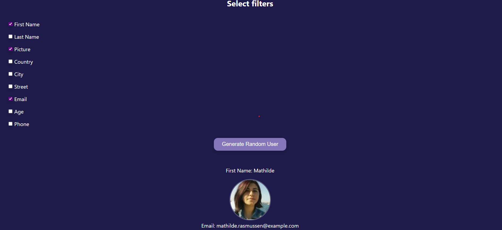

# Random User Generator 

A simple JavaScript project that fetches a random user from the [RandomUser API](https://randomuser.me) and displays only the information you choose via checkboxes.  

---

## Features

- ✅ **Random user generation** using `fetch()` from RandomUser API  
- ✅ **Selectable filters** – choose which user data to display (e.g., First Name, Picture, Email, etc.)  
- ✅ **Dynamic rendering** – only selected fields appear on screen  
- ✅ **Click sound effect** – plays every time the "Generate Random User" button is pressed  
- ✅ **Responsive design ready** – easy to adapt for mobile/desktop

---

## 🛠 How It Works

1. The page loads a list of checkboxes — each representing a data field from the RandomUser API (First Name, Picture, Country, etc.).
2. When you check some boxes and click **"Generate Random User"**, the app:
   - Fetches a random user from the API.
   - Reads which checkboxes are checked.
   - Dynamically displays only the selected information.

---

## 🖼 Example

If you select:
- ✅ First Name  
- ✅ Picture  
- ✅ Email  

You might see:

##  Installation & Usage

1. **Clone this repository** or download the files.
2. Place them in a local folder.
3. Open `index.html` in your browser.
4. Check the fields you want and click **"Generate Random User"**.

---

## 🎯 Technologies Used

- HTML5  
- CSS3  
- JavaScript (Vanilla)  
- [RandomUser API](https://randomuser.me)  

---

## 📜 License

This project is open-source and available under the MIT License.